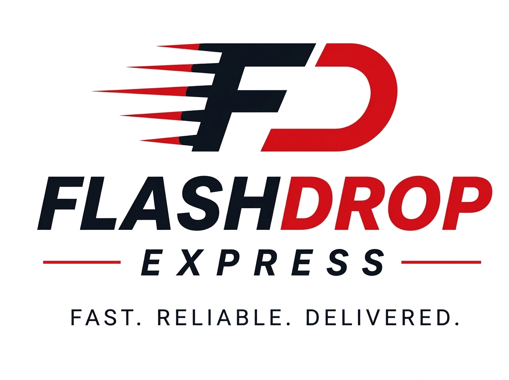

# FlashDrop Express 🚚💨

> **Fast. Reliable. Delivered.**  
> On-demand commercial freight and express courier platform serving Toronto, the Greater Toronto Area (GTA), and Southern Ontario.



---

## ⚡ Overview

**FlashDrop Express** is a production-ready logistics and commercial dispatch web platform designed for contractors, paint and coating suppliers, construction jobsites, and business freight. It provides direct point-to-point courier runs across the GTA with transparent distance pricing, real-time tracking, and guaranteed **Pay Later on Delivery** terms.

---

## 🌟 Key Features

- **Instant Distance Rate Calculator**: Automated distance matrix pricing (0–25 km local, 25–40 km GTA core, 40+ km extended) with vehicle-payload weight tiers and after-hours modifiers.
- **GTA Coverage Autocomplete**: Real-time address classification and postal prefix search for Toronto, Peel, York, Halton, Durham, Hamilton, Niagara, and Waterloo.
- **Express Dispatch Booking**: 4-step streamlined booking wizard generating unique `FD-XXXXXX` dispatch numbers with zero upfront deposit.
- **Live Order Radar Tracking**: Real-time telemetry, simulated highway radar updates, driver assignment status, and stage-by-stage transit milestones.
- **Digital Proof of Delivery (POD)**: Electronic signature capture, delivery photo verification, and automated commercial PDF invoice download.
- **Fleet Specifications**: Support for Sedans (300 lbs), SUVs/Vans (600 lbs / 30 pails), Cargo Vans (1,500 lbs / 64+ pails), and Hydraulic Liftgate Box Trucks (4,000 lbs).
- **Staff & Admin Management**: Built-in Customer Portal, Driver Route Dashboard, and Admin Dispatch Panel for managing live orders and fleet status.
- **Modern Responsive Design**: Accessible WCAG AA touch targets, dark-mode glassmorphism UI, interactive telemetry, and subtle Three.js highway visualization.

---

## 🛠️ Tech Stack

- **Frontend**: React 19, TypeScript, Vite
- **Styling**: Tailwind CSS v4, Lucide Icons
- **3D & Graphics**: Three.js, Canvas Confetti
- **Document Generation**: jsPDF, HTML2Canvas
- **Backend / Database Ready**: Supabase Client Integration & Local Mock Store

---

## 🚀 Quick Start

### 1. Clone the repository
```bash
git clone https://github.com/jiljomathewtechhub-hash/flashdrop-express.git
cd flashdrop-express
```

### 2. Install dependencies
```bash
npm install
```

### 3. Start development server
```bash
npm run dev
```

Visit `http://localhost:3000` (or the port indicated in the terminal).

### 4. Build for production
```bash
npm run build
```

---

## 📂 Project Structure

```
flashdropfinal-project/
├── public/               # Static assets & brand graphics
│   └── images/           # Fleet imagery, logos, and favicons
├── src/
│   ├── components/
│   │   ├── admin/        # Admin dispatch & revenue management
│   │   ├── common/       # Navbar, Footer, Logo, Address autocomplete
│   │   ├── customer/     # Customer order history & invoice portal
│   │   ├── driver/       # Driver dispatch & digital signature POD
│   │   ├── home/         # Hero, Services, Fleet, Calculator, FAQ
│   │   ├── order/        # Multi-step booking wizard
│   │   └── tracking/     # Live shipment tracker & radar HUD
│   ├── lib/              # Pricing engine, distance classifier, store
│   ├── pages/            # Page-level route views
│   ├── types/            # TypeScript interfaces & domain models
│   ├── App.tsx           # Primary routing & view orchestration
│   ├── index.css         # Design tokens, gradients & animations
│   └── main.tsx          # Application entrypoint
├── package.json
└── vite.config.ts
```

---

## 📄 License

Proprietary — All rights reserved © FlashDrop Express Inc.
